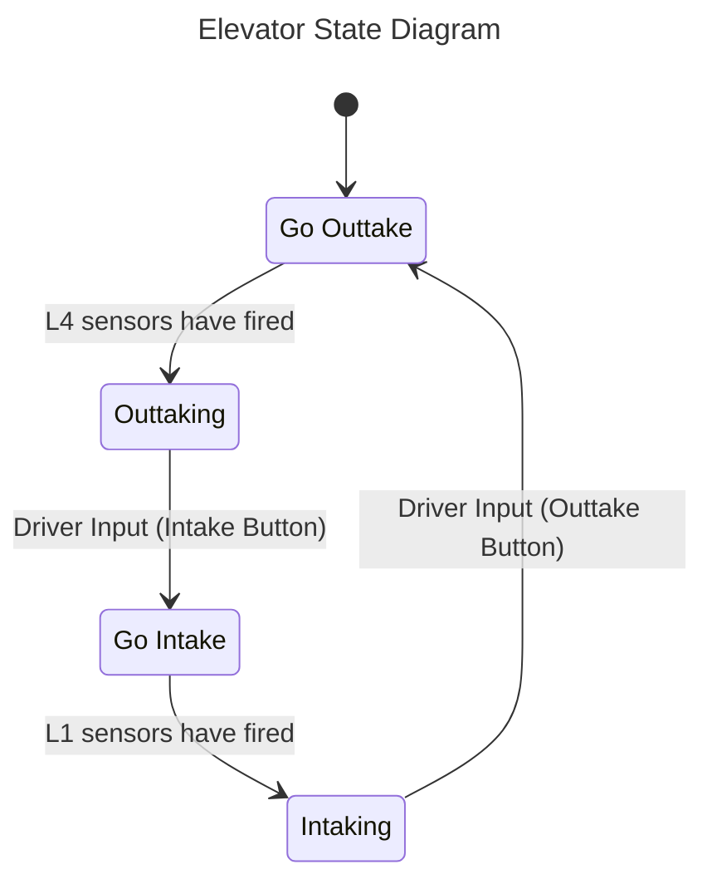

# Elevator FSM Spec

> [link to TED](https://docs.google.com/document/d/16q1ANIi-7iRgye46MMdsdwcLip3dK5yB3aJaUBiBRtI/edit?usp=sharing)

## Important Tips

* The upper limit switch was removed, ignore that in the TED
* The constructor is made for you and correctly sets everything up
* Only edit TeleopInput and ElevatorFSMSystem
* Ignore cameras, these are unrelated to FSM behavior
* Remember, states are CONTINUOUS ACTIONS
* You will need to use PID
* Only 1 exit condition from a state should be true at a time
* Limit switches prevent a mechanism from going out of a physical space it is designed to be in. You can access input from these devices using the DigitalInput class

## Complete the activity in this order:
1. write the FSM
2. change TeleopInput so it has the methods you need
3. Setup file: state handlers (leave empty), update method, reset method, etc.
4. Write the nextState method WHILE LOOKING AT THE FSM DIAGRAM
4. Write the state handlers

